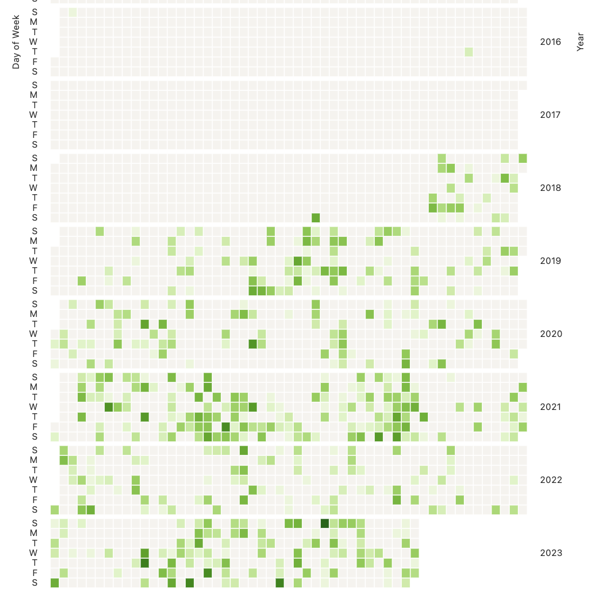

# Apple Photos DB Examiner

    
    

Very WIP. dm me @inerati if you have any issues. 

Electron app that scans your Apple Photos SQlite database and shows you a bunch of cool stats about what apple's ML detection system thinks about you. Completely offline, no network requests :)

go to releases to get latest version. right now it's apple silicon only until I figure out a way to automatically sign the builds/get a semi final release (whatever comes first). Also the releases are GIANT atm as I haven't figured out vite packaging yet lol. 
)