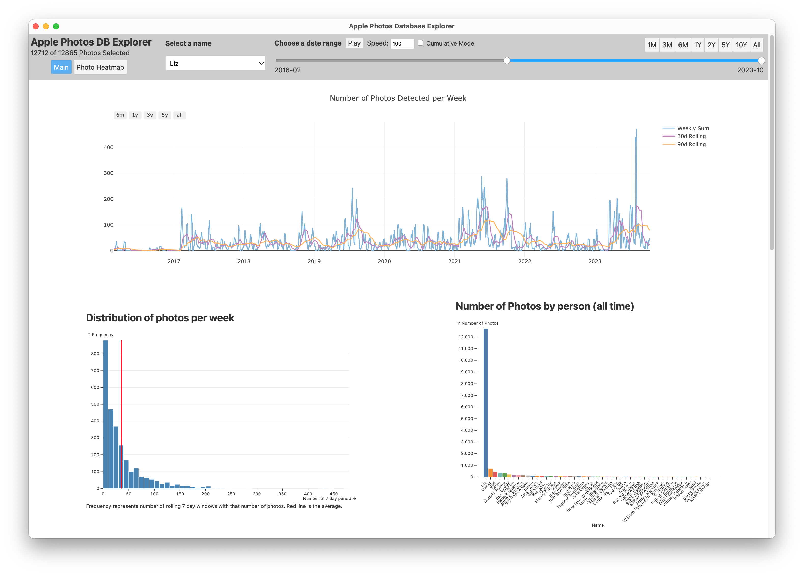
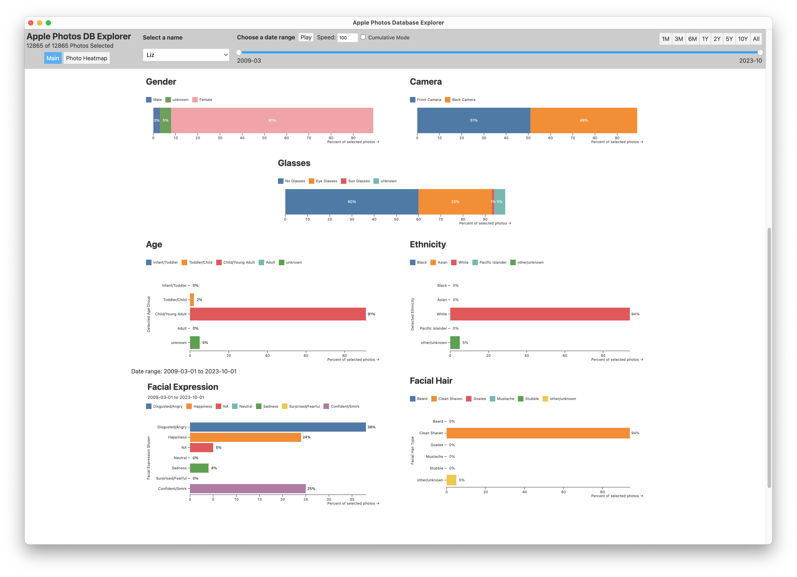
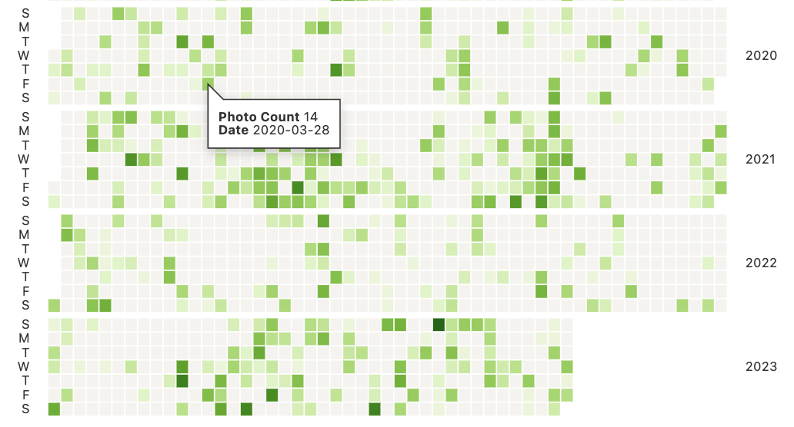

# Apple Photos DB Explorer

What does apple photos think about you?

    
    

   

## What is this?

Every time you take a photo on your iPhone, Apple's ML system tries to detect the quality and content in the photo. This is used for search, but also for the "For You" tab, which shows you memories, people, places, and things that it thinks are important to you.

This app is a simple electron app that automatically scans your Apple Photos library for this metadata, processes it, and then generates a bunch of interactive visualizations and statistics based on it. It also allows you to group by person and scrub through the stats as they change over time (including automatically with the `play` button).

## Requirements

1. A mac with a synced photos library (should still work even if iCloud space saver is turned on, but YMMV)
2. Named faces in said photo library. This is key - Apple photos allows you to assign names to faces it detects in your photos. To do this, go to the "People" tab in the Photos app, and assign names to all the faces you want to show up in the app. It should work rather immediately, and restarting the app redoes the scanning process every time, so it should work fine. 

## Installation

1. Click below to download the latest release from the according to which processor you have (Intel or M1): 
    1. [Apple Silicon Mac (~2020 and later)](https://github.com/lizdotsh/Apple-Photos-DB-Explorer/releases/latest/download/apple-photos-db-explorer-apple-silicon.zip)
    2. [Intel Mac (~2019 and earlier)](https://github.com/lizdotsh/Apple-Photos-DB-Explorer/releases/latest/download/apple-photos-db-explorer-intel.zip)

    
2. Unzip the file
3. **RIGHT CLICK** --> open the .app file. This is important, as the app is not signed, and MacOS will not let you open it otherwise.
    1. Note: this may not work the first time, and give a weird error. Simply right click and open again, and it should give you an 'open' option in the dialog box.
4. The app will automatically scan your photos library, and then open a browser window with the visualization.

If you have any issues, please DM me ASAP. 

## How does it work? 

Importantly, this metadata is user accesible on MacOS. The .photoslibrary file is actually just a folder in disguise, and inside it is a SQLite database. This database contains all the information about your photos, including the ML metadata. Unfortunately, this database is not well documented, and is obviously meant to be used by Apple's Photos app only.

This app is a simple electron app that automatically copied the database and runs a bunch of SQL queries to process and denormalize the dataset into a usable format. It then uses a mix of Svelte and Obervable plot to display this data as a scrubbale interactive visualization. 

## Technical Information

This app is split into two windows. One is not using svelte and is just vanilla JS, for the initial intro screen. This is located in `electron/db_load`. The main thread interacts with both windows and is located in `electron/main.cjs`. 

The database processing scripts are located in `electron/assets` and are just long .sql files. While actually using the app, however, the database is interacted with by a weird JS proxy that bridges the blocking main electron thread and the svelte renderer process. These are all located in `electron/models`, with the api itself being in `electron/api.cjs`.

All UX and visualization is located in `src`. `App.svelte` is the primary window, and all other components are located in `src/lib`, with some specific ones being broken up into `src/lib/agged` and `src/lib/status_bar`. 

Please keep in mind this is the first real thing I have ever made in JS. I have never made even a very simple website before this. If i'm doing anything stupid or wrong please let me know ahah. I'm also aware I should have just used TS and will be for future projects :). 

Also some of the SQL is quite messy and duplicated a lot. More indexes than it probably needs but it doesn't really add much overhead and I don't want to experiment any more with this project ahah. Also a lot of one off tables pre made and indexed are just for specific performance heavy queries used that lagged otherwise. 

## Referenced work: 

I heavily relied on the work of @ScottKjr3347 with their [iOS_Local_PL_Photos.sqlite_Queries](https://github.com/ScottKjr3347/iOS_Local_PL_Photos.sqlite_Queries) repo. The first processing step is a heavily modified version of their .sql file. Everything in `rollup.sql` is completely independent, and `gen_tables.sql` is a modified version of their queries. 